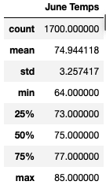
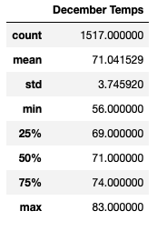

# surfs_up

# Overview of Analysis
Oahu weather and temperature data from the months of June and December will be compared to determine if the surf and ice cream shop business is sustainable year-round.

## Purpose
This analysis was done to determine if opening a surf n' shake shop would be a good investment in Oahu based on weather and temperature data.

# Results

          

- June had a max temperature of 85 degrees which is higher than the max temperature in December by 2 degrees.
- The minimum temperature in December is 56 degrees, this is 8 degrees cooler than the minimum temperature in June.
- 75 percent of the month of June it was over 73 degrees. In December it was only over 73 degrees a little over 25 percent of the month. 

# Summary
The temperatures in Oahu are typically higher in June than they are in December. However the temperature ranges for each month are quite similar. On average the temperature in June is about 74.9 degrees while in December the average temperature is 71.0 degrees. the max temperatures are within two degrees of each other and the medians are within four degrees of each other.
## Additional Queries
Further queries I would want to perform are for wind data and wave data. While temperature and precipitation may be important for the ice cream side of this business it may be equally important to look at conditions that would affect the surfing side of the business. Additionally, I would suggest conducting a t-test to determine if these temperature differences are significant. 